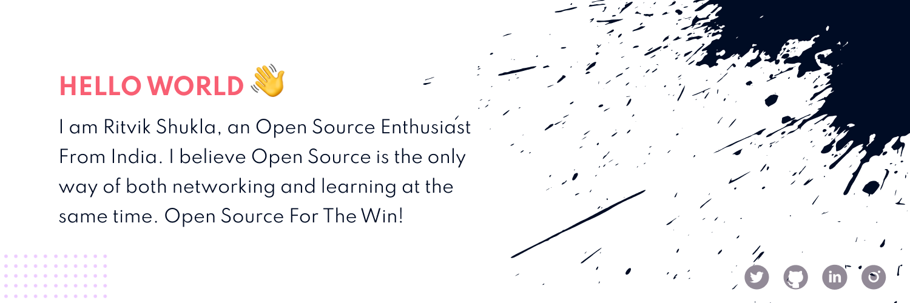

<!-- Banner -->

<!-- About Me -->

 

  
😄 <strong>About me</strong>

  

   <ul>
    <li>
     🌱 I’m currently exploring <strong>Open-Source</strong>
     </li>
    <li>
     😄 Pronouns: <strong>He/Him</strong>
     </li>
     <li>
     ✍️  In my free time, I love to write poems and short stories.
     </li>
     <li>
     🎧 I love to hear Podcasts
     </li>
   </ul>  

 

<!-- Stats  -->
 

  
✨ <strong>Stats</strong>

  

  <table>
   <tbody>
    <tr>
     <td>
       
     </td>
      <td>
       
     </td>    
    </tr>
   </tbody>
 </table> 

 

 

  
📈 <strong>Contribution Graph</strong>

  

  <table>
   <tbody>
    <tr>
     <td>
       
     </td> 
    </tr>
   </tbody>
 </table> 

 

  
🤝 <strong>Connect</strong>

  

  <table>
   <tbody>
    <tr>
     <td>
       </a>
     </td> 
          <td>
       
     </td> 
          <td>
       
     </td> 
    </tr>
   </tbody>
 </table> 

 
